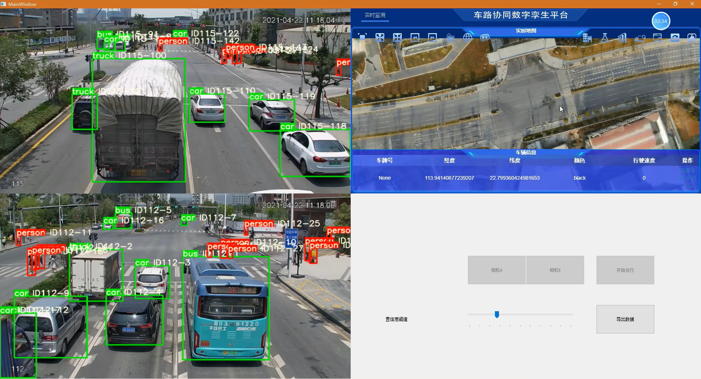

# 西门交通系统
### **演示效果**

### **功能说明**
1. 处理多通道视频
2. 识别和跟踪视频中的人和车辆
3. 虚拟孪生平台显示车辆行驶状况
4. 数据库记录和导出数据

### **所需运行环境**
1. window系统
2. python环境
3. 安装pytorch、opencv、pyqt5、Mysql库


### **用法**
```
python main.py
```
1. 进入主窗口需要输入所需连接数据库的host、用户名、密码、数据库名字。如果使用本机自身mysql数据库，需要下载mysql官方数据库。host应为**localhost**，用户名为**root**，密码和数据库名字在用户创建时确定。
2. 主窗口中点击按钮选择最多两个视频作为输入，点击运行。等待计算完毕后，就会识别视频中出现的车辆和行人，在视频界面和虚拟孪生平台上进行展示。


---
### **引用库**
Yolov5+deepsort车辆识别与跟踪
> Github：[https://github.com/Sharpiless](https://github.com/Sharpiless)


